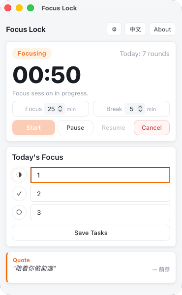

# Focus Lock

A Pomodoro timer with forced break-time screen lock for macOS, Windows, and Linux.

During focus sessions the timer runs normally. When a break starts, a full-screen overlay appears on **every connected display**, hiding the menu bar and Dock, and showing your daily tasks, a quote, and health reminders — so you actually step away from the screen.

---

## Features

- **Pomodoro timer** — configurable focus and break durations, persisted across restarts
- **Multi-display lock** — creates a full-screen overlay window on each monitor at break start
- **macOS fullscreen isolation** — hides the menu bar and Dock during breaks, window level above the system status bar, Cmd+Option+Esc force-quit disabled
- **Today's tasks** — up to 3 items, auto-cleared each day, shown on the lock screen
- **Quotes** — fetched from the [hitokoto.cn](https://v1.hitokoto.cn/) API with a 24-hour cache; falls back to built-in copy when offline
- **Health reminders** — water and stand-up reminders cycling on the lock screen
- **Auto-restart** — optionally start the next focus round automatically after a break
- **System tray** — hides to the tray when the main window is closed
- **Persistent settings** — all configuration is saved to the OS app config directory and survives restarts
- **Chinese / English UI** — language toggle in the header, follows system locale by default

## Screenshot

Main window



## System Requirements

| Platform | Minimum version |
|----------|----------------|
| macOS | 10.15 Catalina |
| Windows | 10 |
| Linux | GTK 3 + WebKitGTK 4.1 (Ubuntu 22.04 / Fedora 36+) |

---

## Installation

### macOS (DMG)

Download the latest `.dmg` from the [Releases](https://github.com/acdiost/focus-lock/releases) page:

- Apple Silicon (M-series): `Focus Lock_x.x.x_aarch64.dmg`
- Intel: `Focus Lock_x.x.x_x64.dmg`

Open the DMG and drag **Focus Lock** into the **Applications** folder.

> **First-launch notice**: because the app is not notarized by Apple, macOS will warn "developer cannot be verified".
> Right-click the app in Finder → **Open** → click **Open** again. After that, double-click works normally.
>
> **"App is damaged and can't be opened"**: macOS Ventura and later may show this stricter error, where right-clicking no longer helps. Run the following command in Terminal to strip the quarantine flag, then double-click normally:
>
> ```bash
> xattr -cr /Applications/FocusLock.app
> ```

### Windows (MSI)

Download `Focus Lock_x.x.x_x64_en-US.msi` from the [Releases](https://github.com/acdiost/focus-lock/releases) page and run the installer.

> Windows SmartScreen may display a warning because the binary is unsigned. Click **More info → Run anyway** to proceed.

### Linux (AppImage / deb)

Download the package that suits your distribution from the [Releases](https://github.com/acdiost/focus-lock/releases) page.

**AppImage** (universal, no installation required):

```bash
chmod +x focus-lock_x.x.x_amd64.AppImage
./focus-lock_x.x.x_amd64.AppImage
```

**deb package** (Debian / Ubuntu):

```bash
sudo dpkg -i focus-lock_x.x.x_amd64.deb
```

> The Linux build requires `libwebkit2gtk-4.1-0`, `libgtk-3-0`, and `libayatana-appindicator3-1` (tray support). Ubuntu 22.04+ ships GTK 3; install the remaining libraries with `sudo apt install libwebkit2gtk-4.1-0 libayatana-appindicator3-1`.

---

## Development

### Prerequisites

| Tool | Notes |
|------|-------|
| [Node.js](https://nodejs.org/) 18+ | JavaScript runtime |
| [Rust](https://rustup.rs/) stable 1.95+ | Backend compiler |
| Xcode Command Line Tools | macOS only — `xcode-select --install` |
| WebView2 + MSVC build tools | Windows only |
| GTK 3 / WebKitGTK / AppIndicator | Linux only — see below |

**Linux build dependencies** (Ubuntu / Debian):

```bash
sudo apt install libwebkit2gtk-4.1-dev libgtk-3-dev \
  libayatana-appindicator3-dev librsvg2-dev patchelf
```

Fedora / RHEL:

```bash
sudo dnf install webkit2gtk4.1-devel gtk3-devel \
  libayatana-appindicator-gtk3-devel librsvg2-devel patchelf
```

### Quick start

```bash
# Clone the repository
git clone https://github.com/acdiost/focus-lock.git
cd focus-lock

# Install JS dependencies
npm install

# Start dev mode (hot-reload)
npm run dev
```

The frontend (`src/`) is plain HTML/CSS/JS with no build step — changes are visible immediately after the WebView refreshes.

### Run unit tests

```bash
cd src-tauri && cargo test
```

### Regenerate app icons

```bash
node scripts/gen-icons.mjs
```

---

## Build & Package

```bash
npm run build
```

Build artifacts:

| Platform | Output |
|----------|--------|
| macOS | `src-tauri/target/release/bundle/dmg/Focus Lock_x.x.x_aarch64.dmg` |
| Windows | `src-tauri/target/release/bundle/msi/Focus Lock_x.x.x_x64_en-US.msi` |
| Linux | `src-tauri/target/release/bundle/appimage/focus-lock_x.x.x_amd64.AppImage` |
| Linux | `src-tauri/target/release/bundle/deb/focus-lock_x.x.x_amd64.deb` |

> In Tauri v2, tray support is enabled via the `tray-icon` feature in `Cargo.toml` — no extra flags are needed in the npm scripts.

### Code signing (optional)

The default configuration ships unsigned. For notarized distribution, update the `bundle.macOS` section of `src-tauri/tauri.conf.json`:

```json
"macOS": {
  "signingIdentity": "Developer ID Application: Your Name (XXXXXXXXXX)",
  "hardenedRuntime": true,
  "entitlements": "entitlements.plist"
}
```

---

## Project Structure

```
focus-lock/
├── src/                    # Frontend (no build step)
│   ├── index.html          # Single page: main timer UI + break lock view
│   ├── app.js              # All client-side logic
│   └── style.css           # Styles
├── src-tauri/
│   ├── src/main.rs         # All backend logic (~1100 lines)
│   ├── capabilities/       # Tauri v2 permission configuration
│   ├── icons/              # App icons (generated by scripts/gen-icons.mjs)
│   └── tauri.conf.json     # Tauri configuration
└── scripts/
    └── gen-icons.mjs       # Icon generation script (no extra dependencies)
```

### Core modules

| Module | Description |
|--------|-------------|
| `PersistentState` | Serialized to JSON in the OS app config dir; stores settings, daily tasks, quote cache, and completed cycle count; auto-resets daily data when the date changes |
| `RuntimeState` | In-memory state: current phase (`Idle` / `Focus` / `Break`), remaining seconds, pause flag |
| Background timer thread | Ticks every second, drives phase transitions, pushes a `Snapshot` to the frontend via `pomodoro://state` events |
| `sync_lock_windows` | Creates a borderless full-screen `WebviewWindow` for each monitor at break start; on macOS also sets the window level to `NSScreenSaverWindowLevel` and hides the menu bar |
| `build_tray_menu` | Dynamically builds the tray right-click menu using the Tauri v2 `Menu`/`MenuItem` API; rebuilt on every state change |
| `tray_icon` | Embedded PNG via `include_bytes!`; uses macOS template mode to auto-adapt to light/dark themes |

---

## Known Limitations

- App-level lock only, not a system-level screen lock. macOS is significantly hardened via elevated window level and hidden menu bar, but a determined user can still break out under extreme circumstances.
- Hot-plugging a monitor during a break does not create a lock window for the new display; the lock will be recreated on the next break.
- On Linux, fullscreen lock effectiveness depends on the window manager. Tiling WMs such as i3 or Sway may not fully prevent workspace switching.
- The Windows binary is unsigned; SmartScreen may prompt a warning on first install.

---

## Tech Stack

- [Tauri v2](https://tauri.app/) — Rust backend + WebView shell
- [chrono](https://crates.io/crates/chrono) / [reqwest](https://crates.io/crates/reqwest) / [serde](https://crates.io/crates/serde) — time, networking, serialization
- Frontend: vanilla HTML / CSS / JavaScript, no framework, no build tool

---

## License

MIT © 2026 [acdiost](https://github.com/acdiost)
