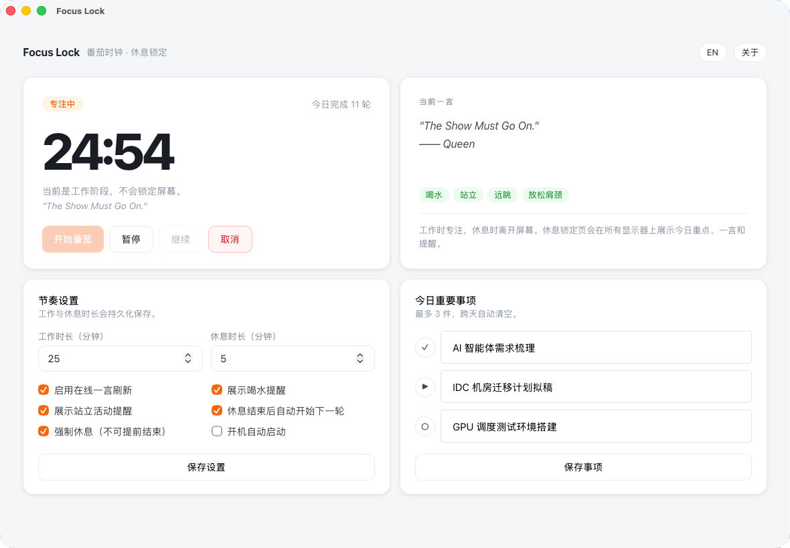

# Focus Lock

Focus Lock 是一个带「强制休息锁屏」的番茄时钟桌面应用。

它适合想减少连续久坐、避免休息时间继续刷屏或工作的用户：专注时正常倒计时，休息开始后会在所有显示器上显示全屏休息界面，提醒你离开屏幕、喝水、站起来活动一下。


v2.1.1 以前的版本界面



## 你可以用它做什么

- 设置工作和休息时长，例如 25 分钟专注、5 分钟休息
- 在休息时间锁住所有屏幕，降低「再看一眼」的冲动
- 记录今天最重要的 3 件事，并在休息页上持续提醒
- 查看一言和健康提醒，让休息不只是换个窗口继续盯屏幕
- 选择是否自动开始下一轮番茄
- 选择是否启用强制休息，防止提前结束休息
- 支持中文和英文界面

## 下载与安装

前往 [Releases](https://github.com/acdiost/focus-lock/releases) 下载适合你系统的安装包。

### macOS

- Apple Silicon（M 系列芯片）：下载 `aarch64.dmg`
- Intel 芯片：下载 `x64.dmg`

打开 DMG 后，把 **FocusLock** 拖到 **Applications** 文件夹。

如果首次打开时提示「无法验证开发者」，在 Finder 中右键点击应用，选择 **打开**，再确认打开即可。

如果提示「已损坏，无法打开」，可在终端执行：

```bash
xattr -cr /Applications/FocusLock.app
```

### Windows

下载 `.msi` 安装包并运行。

如果 Windows SmartScreen 提示风险，选择 **更多信息**，再选择 **仍要运行**。

### Linux

可下载 AppImage 或 deb 包。

AppImage：

```bash
chmod +x focus-lock_x.x.x_amd64.AppImage
./focus-lock_x.x.x_amd64.AppImage
```

deb：

```bash
sudo dpkg -i focus-lock_x.x.x_amd64.deb
```

## 基本使用

1. 打开 Focus Lock。
2. 在「节奏设置」里设置工作时长和休息时长。
3. 按需填写「今日重要事项」。
4. 点击「开始番茄」进入专注计时。
5. 专注结束后，应用会自动进入休息锁屏。
6. 休息结束后，回到主界面开始下一轮。

如果开启「休息结束后自动开始下一轮」，休息完成后会自动进入下一次专注计时。

如果开启「强制休息」，休息期间不能提前结束。

## 使用建议

- 把工作时长设置为你能稳定完成的长度，常见选择是 25、45 或 50 分钟。
- 休息时间建议至少 5 分钟，长时间工作后可以设置更长。
- 今日重要事项只写真正重要的 1 到 3 件事，避免把它当成完整待办清单。
- 休息开始后尽量真的离开屏幕，而不是切换到手机。

## 注意事项

- Focus Lock 是应用级锁定，不是系统级锁屏。它用于帮助你执行休息计划，而不是安全防护工具。
- 多显示器锁屏会在休息开始时创建；如果休息期间临时接入新显示器，可能需要等下一轮休息才会覆盖。
- macOS 和 Windows 安装包当前未进行正式代码签名，首次安装时系统可能会提示风险。
- Linux 桌面环境差异较大，部分 Wayland 窗口管理器可能无法完全阻止切换工作区。

## 技术文档

开发、构建、项目结构和实现细节见 [TECHNICAL.md](TECHNICAL.md)。

## License

MIT © 2026 [acdiost](https://github.com/acdiost)
