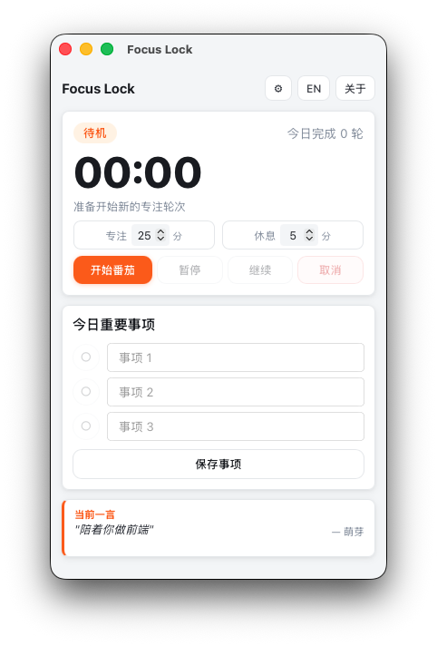

# Focus Lock

番茄时钟 + 休息强制锁屏桌面应用，支持 macOS、Windows 和 Linux。

工作阶段正常计时；休息阶段在**所有显示器**上覆盖全屏锁定层，隐藏菜单栏与 Dock，展示今日重要事项、一言和健康提醒，防止分心继续工作。

---

## 功能特性

- **番茄计时** — 可配置工作 / 休息时长，持久化保存
- **多屏锁定** — 休息开始时在每台显示器上创建全屏覆盖窗口
- **macOS 全屏隔离** — 休息期间隐藏菜单栏与 Dock，窗口层级高于系统状态栏，禁用 Cmd+Option+Esc 强制退出
- **今日重要事项** — 最多 3 条，按自然日自动清空，锁屏界面同步展示
- **一言** — 调用 [hitokoto.cn](https://v1.hitokoto.cn/) API，24 小时缓存，离线时自动使用本地文案
- **健康提醒** — 喝水 / 站立活动提醒，在锁屏界面轮播
- **无限循环** — 可选择休息结束后自动开始下一轮专注
- **系统托盘** — 关闭主窗口后隐藏到托盘
- **设置持久化** — 所有配置保存在系统应用目录，重启后保留

## 截图

主界面



## 系统要求

| 平台 | 最低版本 |
|------|---------|
| macOS | 10.15 Catalina |
| Windows | 10 |
| Linux | GTK 3 + WebKitGTK 4.1（Ubuntu 22.04 / Fedora 36+） |

---

## 安装

### macOS（DMG）

从 [Releases](https://github.com/acdiost/focus-lock/releases) 页面下载最新的 `.dmg` 文件：

- Apple Silicon（M 系列）：`Focus Lock_x.x.x_aarch64.dmg`
- Intel：`Focus Lock_x.x.x_x64.dmg`

打开 DMG，将 **Focus Lock** 拖入 **Applications** 文件夹。

> **首次打开提示**：由于应用未经 Apple 公证，macOS 会提示"无法验证开发者"。
> 在 Finder 中右键点击应用 → **打开** → 再次点击**打开**即可，此后正常双击运行。
>
> **提示"已损坏，无法打开"**：macOS Ventura 及更新版本在某些情况下会显示更严格的提示，右键打开无效。在终端执行以下命令移除隔离标记，然后正常双击打开：
>
> ```bash
> xattr -cr /Applications/Focus\ Lock.app
> ```

### Linux（AppImage / deb）

从 [Releases](https://github.com/acdiost/focus-lock/releases) 页面下载对应格式：

**AppImage**（通用，无需安装）：

```bash
chmod +x focus-lock_x.x.x_amd64.AppImage
./focus-lock_x.x.x_amd64.AppImage
```

**deb 包**（Debian / Ubuntu）：

```bash
sudo dpkg -i focus-lock_x.x.x_amd64.deb
```

> Linux 版本要求系统已安装 `libwebkit2gtk-4.1-0`、`libgtk-3-0` 和 `libayatana-appindicator3-1`（托盘支持）。Ubuntu 22.04+ 通常已自带 GTK 3；WebKitGTK 4.1 和托盘库可通过 `sudo apt install libwebkit2gtk-4.1-0 libayatana-appindicator3-1` 安装。

---

## 开发

### 环境依赖

| 工具 | 说明 |
|------|------|
| [Node.js](https://nodejs.org/) 18+ | JavaScript 运行时 |
| [Rust](https://rustup.rs/) stable 1.95+ | 后端编译 |
| Xcode Command Line Tools | 仅 macOS，`xcode-select --install` |
| WebView2 + MSVC 构建工具 | 仅 Windows |
| GTK 3 / WebKitGTK / AppIndicator | 仅 Linux，见下方说明 |

**Linux 构建依赖**（Ubuntu / Debian）：

```bash
sudo apt install libwebkit2gtk-4.1-dev libgtk-3-dev \
  libayatana-appindicator3-dev librsvg2-dev patchelf
```

Fedora / RHEL：

```bash
sudo dnf install webkit2gtk4.1-devel gtk3-devel \
  libayatana-appindicator-gtk3-devel librsvg2-devel patchelf
```

### 快速开始

```bash
# 克隆仓库
git clone https://github.com/acdiost/focus-lock.git
cd focus-lock

# 安装 JS 依赖
npm install

# 启动开发模式（热重载）
npm run dev
```

前端（`src/`）为纯 HTML/CSS/JS，无构建步骤，修改后刷新 WebView 即时生效。

### 运行单元测试

```bash
cd src-tauri && cargo test
```

### 重新生成应用图标

```bash
node scripts/gen-icons.mjs
```

---

## 构建与打包

```bash
npm run build
```

构建产物位置：

| 平台 | 产物 |
|------|------|
| macOS | `src-tauri/target/release/bundle/dmg/Focus Lock_x.x.x_aarch64.dmg` |
| Windows | `src-tauri/target/release/bundle/msi/Focus Lock_x.x.x_x64_en-US.msi` |
| Linux | `src-tauri/target/release/bundle/appimage/focus-lock_x.x.x_amd64.AppImage` |
| Linux | `src-tauri/target/release/bundle/deb/focus-lock_x.x.x_amd64.deb` |

> Tauri v2 中托盘支持通过 `Cargo.toml` 的 `tray-icon` feature 开启，构建脚本无需额外参数。

### 代码签名（可选）

当前配置不进行代码签名。如需正式公证分发，在 `src-tauri/tauri.conf.json` 的 `bundle.macOS` 中配置：

```json
"macOS": {
  "signingIdentity": "Developer ID Application: Your Name (XXXXXXXXXX)",
  "hardenedRuntime": true,
  "entitlements": "entitlements.plist"
}
```

---

## 项目结构

```
focus-lock/
├── src/                    # 前端（无构建步骤）
│   ├── index.html          # 单页：主界面 + 锁屏视图
│   ├── app.js              # 全部客户端逻辑
│   └── style.css           # 样式
├── src-tauri/
│   ├── src/main.rs         # 全部后端逻辑（~1100 行）
│   ├── capabilities/       # Tauri v2 权限配置
│   ├── icons/              # 应用图标（由 scripts/gen-icons.mjs 生成）
│   └── tauri.conf.json     # Tauri 配置
└── scripts/
    └── gen-icons.mjs       # 图标生成脚本（无额外依赖）
```

### 核心模块说明

| 模块 | 描述 |
|------|------|
| `PersistentState` | 序列化到系统应用目录（JSON）；保存设置、今日任务、一言缓存、完成轮次；按自然日自动重置每日数据 |
| `RuntimeState` | 内存状态；当前阶段（`Idle` / `Focus` / `Break`）、剩余秒数、暂停标志 |
| 后台计时线程 | 每秒 tick，驱动阶段转换，通过 `pomodoro://state` 事件向前端推送快照 |
| `sync_lock_windows` | 休息开始时为每台显示器创建无边框全屏 `WebviewWindow`；macOS 额外设置窗口层级（`NSScreenSaverWindowLevel`）并隐藏菜单栏 |
| `build_tray_menu` | 根据当前阶段动态构建托盘右键菜单（基于 Tauri v2 `Menu`/`MenuItem` API），每次状态变更时刷新 |
| `tray_icon` | 嵌入式 PNG（`include_bytes!`），macOS 启用模板模式自动适配深浅色主题 |

---

## 已知限制

- 应用级锁定，非系统级锁屏。macOS 已通过提升窗口层级和隐藏菜单栏缓解，但用户在极端操作下仍可能切出
- 多屏热插拔不会动态更新锁屏窗口，需要等待当轮休息结束或手动取消后重新触发
- Linux 上的全屏锁定效果依赖窗口管理器行为，部分平台（如 i3/Sway）可能无法完全阻止切换
- Windows 未配置代码签名，安装时 SmartScreen 可能弹出警告

---

## 技术栈

- [Tauri v2](https://tauri.app/) — Rust 后端 + WebView 前端壳
- [chrono](https://crates.io/crates/chrono) / [reqwest](https://crates.io/crates/reqwest) / [serde](https://crates.io/crates/serde) — 时间、网络、序列化
- 前端：原生 HTML / CSS / JavaScript，无框架，无构建工具

---

## License

MIT © 2026 [acdiost](https://github.com/acdiost)
